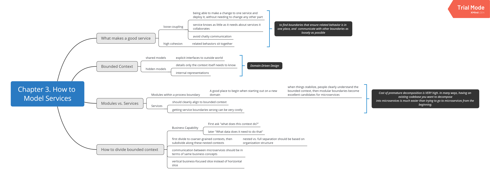

# Building_Microservices_Mindmaps
This repository contains mind maps I summarized during the 2nd round reading of book "Building Microservices" by Sam Newman, published by O’Reilly.
Original xmind files are uploaded.
## Chapter 1. Overview

## Chapter 2. The Evolutionary Architect
## Chapter 3. How to Model Services

## Chapter 4. Integration

## Chapter 5. Splitting the Monolith
This chapter is not very easy to summarize since that the topic "Splitting the Monolith" is not dry abstract concept but has to be understood and applied in concrete practices. The writer used a virtual scenario of an online music store to demonstrate why, how and when to do splitting of existing monolith system and how to tackle some typical problems programmers may encounter.

## Chapter 6. Deployment

## Chapter 7. Testing

